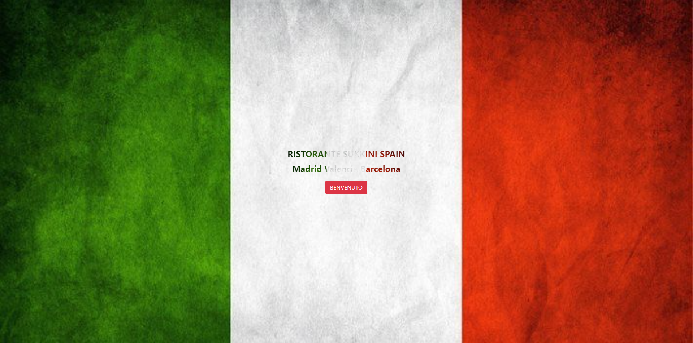
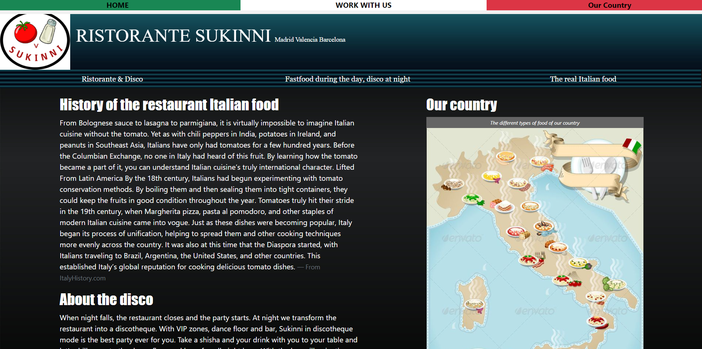
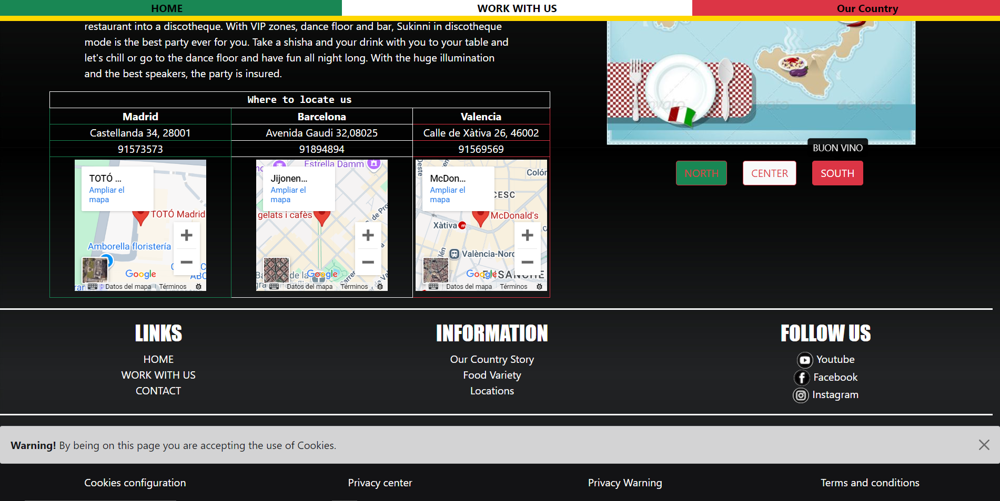
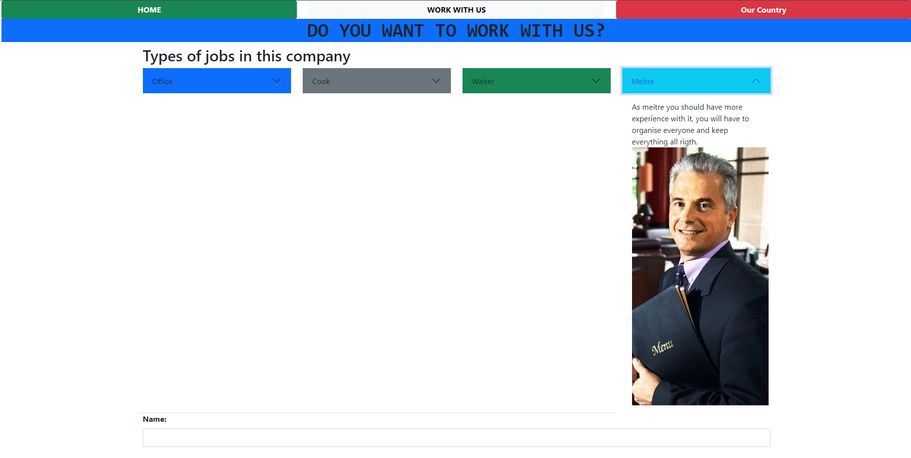
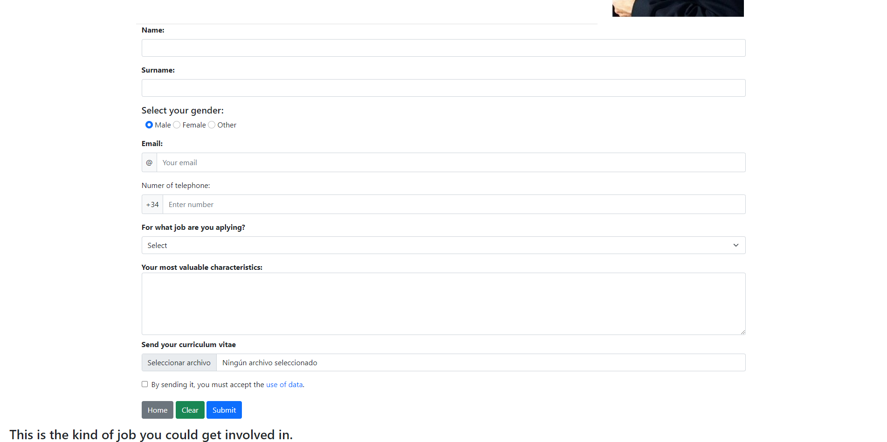
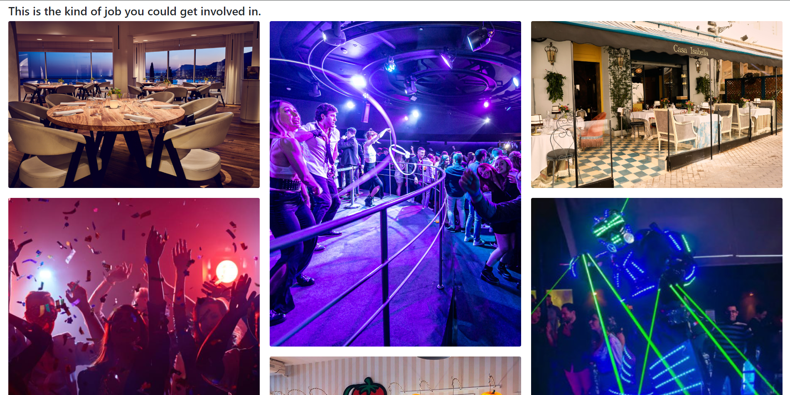
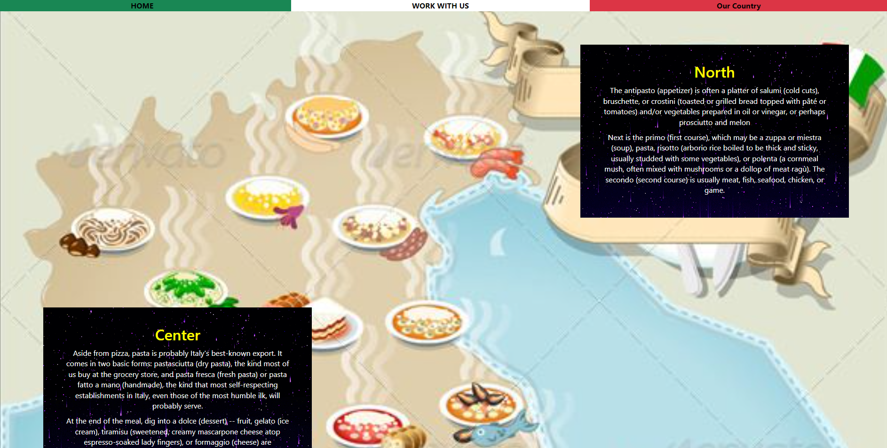
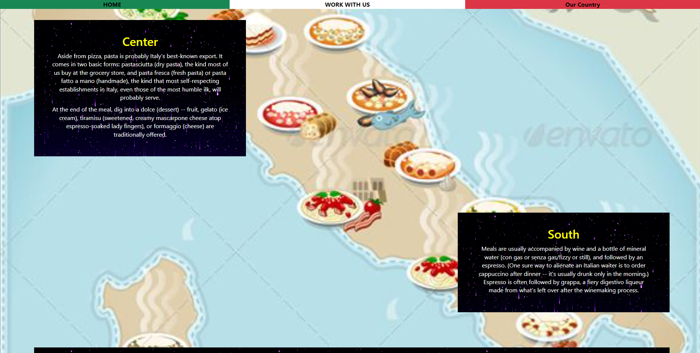
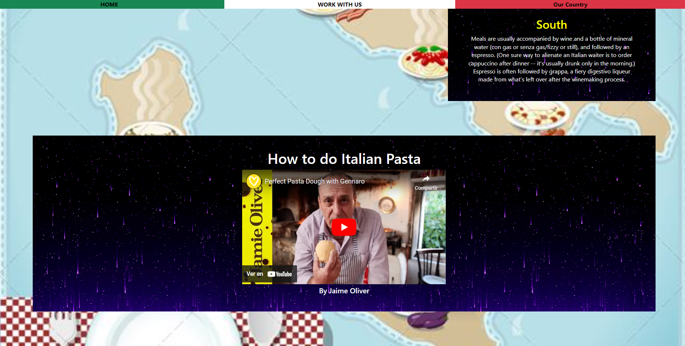

# **Pagina_Restaurante**

## **Introducción**
Este proyecto consiste en una página web de presentación inspirada en un restaurante italiano con cuatro secciones principales que muestran el uso de diferentes tecnologías y técnicas de desarrollo web. Las páginas están diseñadas para mostrar las habilidades adquiridas en HTML, CSS, JavaScript y Bootstrap, y cómo integrarlas para crear una página web funcional y visualmente atractiva.

## **Herramientas Utilizadas**
- **HTML**: Para la estructura básica de las páginas.
- **CSS**: Para los estilos y el diseño visual de las páginas.
- **JavaScript**: Para la interactividad y dinámicas en algunas páginas.
- **Bootstrap**: Para facilitar el diseño responsivo y la maquetación.

## **Explicación de las Páginas**
1. **Portada**:
   Página de bienvenida con fondo de la bandera italiana con un diseño limpio y sencillo. Es la primera página que se muestra al acceder al sitio.
   
   

2. **Página Principal (HTML, CSS, Bootstrap y JavaScript)**:
   Esta página con la información principal de la compañía utiliza una combinación de HTML para la estructura, CSS para los estilos, Bootstrap para la disposición responsiva y JavaScript para la interacción dinámica. Es la página más compleja del proyecto.

   
   

4. **Página Solo HTML y Bootstrap**:
   Esta página de reclutamiento de personal está construida solo con HTML y JavaScript, ofreciendo una funcionalidad específica sin necesidad de CSS.

   
   
   

5. **Página Solo HTML y CSS**:
   Página de información sobre Italia, el país de origen de la compañía, que utiliza únicamente HTML y CSS para mostrar cómo se puede crear un diseño visual atractivo sin utilizar JavaScript o Bootstrap.

   
   
   

## **Proceso de Instalación**
Para ejecutar este proyecto en tu máquina local, sigue los siguientes pasos:

1. Clona este repositorio:
   ```bash
   git clone https://github.com/CarlosHernandezCR/Pagina_Restaurante.git
   
2. Descargar Bootstrap: Utiliza el siguiente enlace para acceder directamente a los archivos de Bootstrap:

[Descargar Bootstrap](getbootstrap.com)

3. Insertar los archivos en las carpetas correspondientes:

  -Extrae los archivos descargados de Bootstrap.
  -Coloca los archivos css en la carpeta css del proyecto.
  -Coloca los archivos js en la carpeta js del proyecto.
  
4. Verificar: Una vez que hayas colocado los archivos en las carpetas adecuadas, abre los archivos HTML en tu navegador para     ver el proyecto en acción.

No se requieren dependencias adicionales para este proyecto, ya que todas las tecnologías utilizadas están integradas en los archivos HTML.

Conclusión
Este proyecto es una demostración básica de cómo utilizar HTML, CSS, Bootstrap y JavaScript para crear una página web sencilla pero funcional. A través de este ejercicio, se ha aprendido la implementación de un diseño responsivo con Bootstrap
